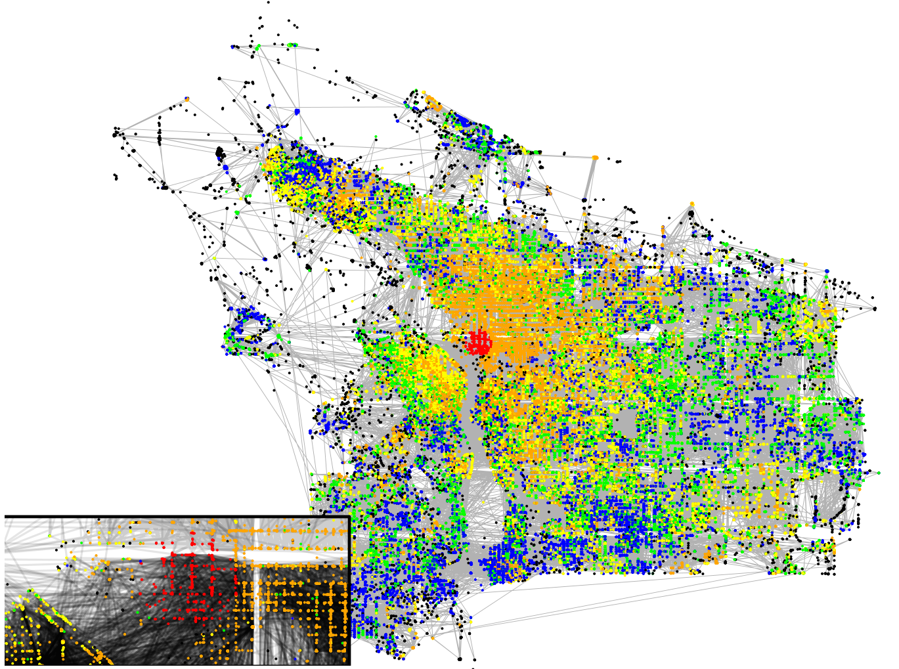

<b>News</b> 
 

&nbsp; 

## R for ERGM Analysis

This lab is written for the [Networks and Health Workshop](https://dnac.ssri.duke.edu/social-networks-health-scholars-training-program.php) at [Duke University](https://www.duke.edu/). The material for this lab is based on the [statnet](statnet.csde.washington.edu) team workshops given at various sunbelts and other conferences. The focus of this lab is on statistical inference of networks based on the ERGM framework, and will include details on model fitting, model analysis, simulation and goodness of fit diagnostics. Altogether the lab will have the following structure:

* Install R
* Install RStudio
* Use RStudio and Github to download all workshop materials
* Follow along workshop html, RMarkdown and R files
* Do some exercises!

